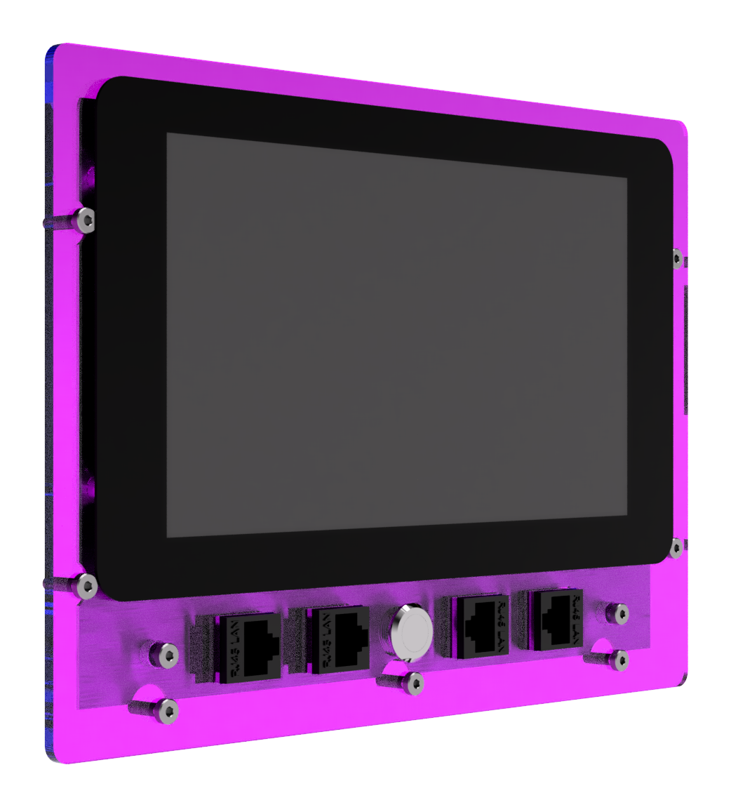
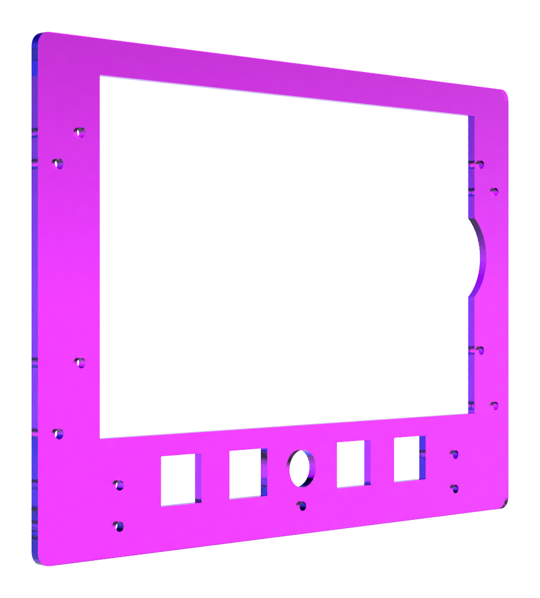
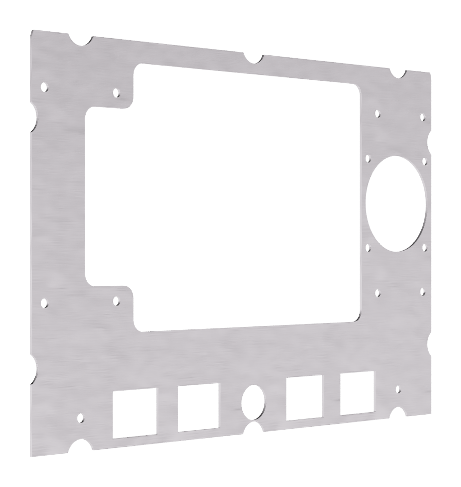
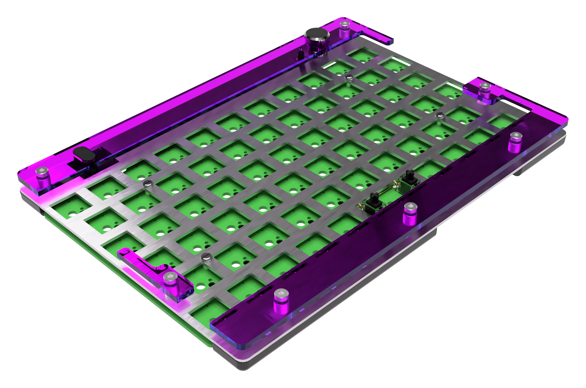
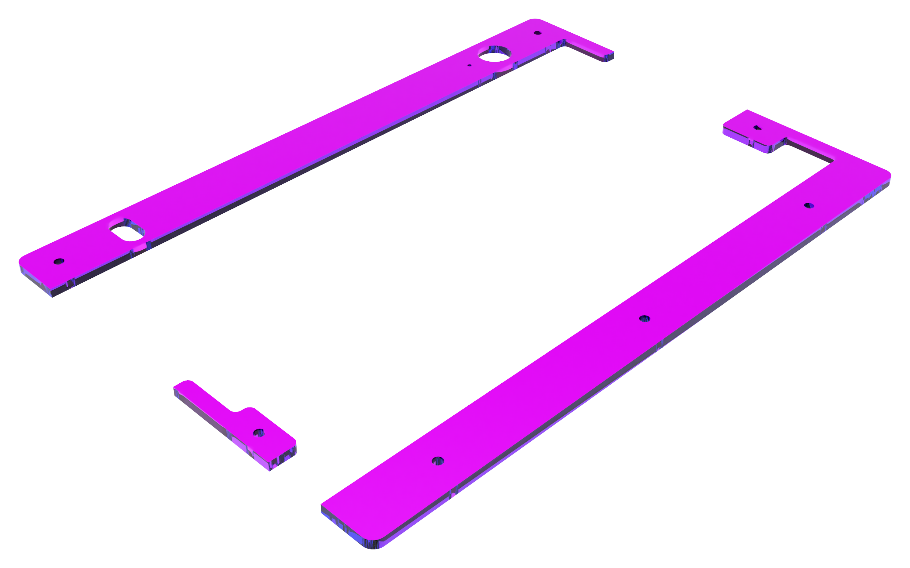
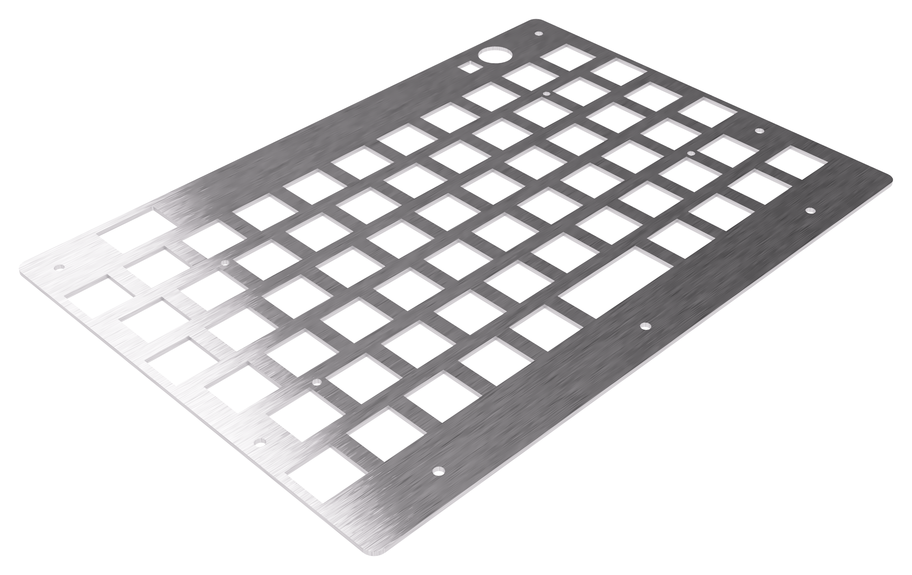
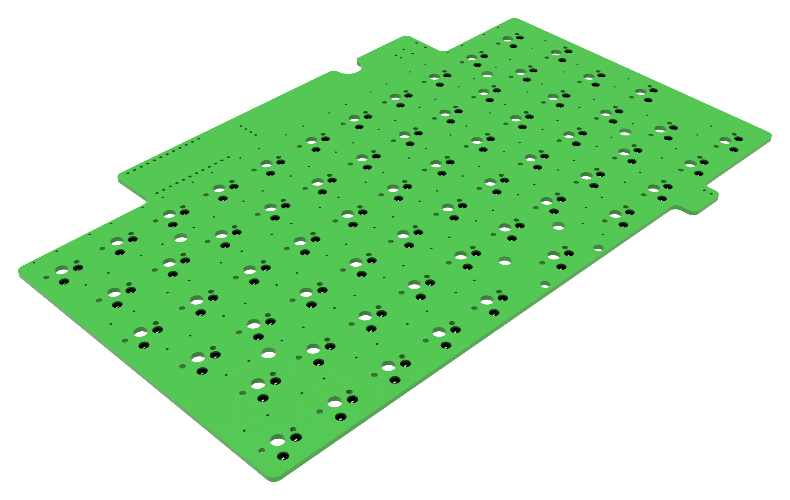
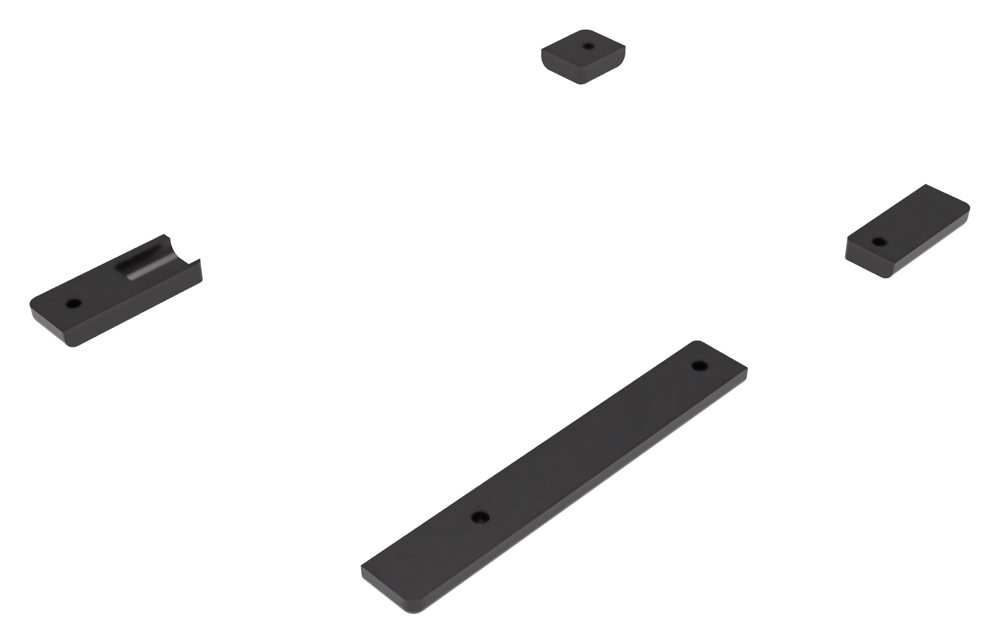

# Little Luggable

Raspberry Pi Portable


## Overview

The Little Luggable is my take on a cyberdeck. It's built around the [Raspberry Pi 4 Model B](https://www.raspberrypi.com/products/raspberry-pi-4-model-b/) and the [Pelican 1150 Protector Case](https://www.peli.com/eu/en/product/cases/protector/1150) and is loosely based on Jay Doscher's [Metal Kit](https://doscher.com/work/metal-kit). It includes a fully-custom mechanical keyboard designed to perfectly fit the lid of the 1150.

Check out the [project page](https://jbmorley.co.uk/projects/little-luggable) on my website for more.

## Making Your Own

Little Luggable is licensed under Creative Commons Attribution 4.0 and I'd love to see people take the design and make it their own. Pull requests are encouraged–I'm excited to see where we can take this. Please share photos if you do make one.

Right now I have a few spare PCBs and aluminium screen mounting plates as I had to order in bulk so reach out if you'd like one at cost + shipping.

The original design was done in Fusion 360 which makes it a little hard to share, but I'm happy to figure out ways to do so if there's interest.

## Parts

Where possible, the Little Luggable uses off-the-shelf parts. I've separated these out and tried to provide links to places you can purchase standard parts. The links are currently pretty UK / US centric and I'd love pull requests for options for other markets.

### Screen and Computer



#### Off-the-shelf

| **Part**                                                     | **Quantity** |
| ------------------------------------------------------------ | ------------ |
| [Raspberry Pi 4 Model B](https://www.raspberrypi.com/products/raspberry-pi-4-model-b/) | 1            |
| [Raspberry Pi Touch Display](https://www.raspberrypi.com/products/raspberry-pi-touch-display/) | 1            |
| [PiJuice HAT](https://uk.pi-supply.com/products/pijuice-standard) | 1            |
| [PiJuice 12000mAh Battery](https://uk.pi-supply.com/products/pijuice-12000mah-battery) | 1            |
| [Pelican 1150 Protector Case](https://peliproducts.co.uk/products/1150-protector-case) | 1            |
| [Pelican 1150 Panel Frame](https://peliproducts.co.uk/products/1150-panel-frame) | 1            |
| [M3 Washer](https://www.amazon.co.uk/3mm-Flat-Washer-Form-Stainless/dp/B08TDPSBBY) | 4            |
| [M3 Spacer, 3mm](https://www.amazon.co.uk/dp/B0BHJP3KJP)     | 6            |
| [Raspberry Pi Standoff Set, 11mm](https://thepihut.com/products/raspberry-pi-standoff-set-11mm) | 1            |
| [USB-C Keystone Jack](https://www.amazon.co.uk/dp/B07Z947FRN) | 2            |
| [RJ45 Keystone Jack](https://www.amazon.co.uk/dp/B07KMQPC3L) | 1            |
| [USB-A Keystone Cable](https://www.amazon.co.uk/dp/B09B3YC29M) | 1            |

#### Custom

- Fascia, 3mm Acrylic, Laser Cut

  

- Mounting Plate, 1mm Aluminium, Laser Cut
  

### Keyboard



#### Off-the-shelf

| **Part**                                                     | **Quantity** |
| ------------------------------------------------------------ | ------------ |
| [nice!nano](https://nicekeyboards.com/nice-nano/)            | 1            |
| [Rama Works GRID Set A Keycaps, Kuro](https://ramaworks.store/collections/grid/products/grid-set-a?variant=16185106235435) | 46           |
| [Rama Works GRID Set B Keycaps, Noct](https://ramaworks.store/collections/grid/products/grid-set-b?variant=31922049286222) | 18           |
| [M3 Spacer, 5mm](https://www.amazon.co.uk/dp/B0BHKJG3ST)     | 7            |
| 6mm tactile push button                                      | 1            |
| [Kailh MX Hotswap Sockets](https://mechboards.co.uk/products/kailh-hotswap-sockets) | 64           |
| [3.7V 90mAh Lithium Polymer Battery](https://www.ebay.co.uk/itm/195234783901) | 1            |
| [M3 Knurled Insert Nuts, 0.5mm](https://www.amazon.co.uk/dp/B09MCX5HN5) | 5            |
| [1N4148 Throughhole Diode](https://mechboards.co.uk/products/throughhole-diodes) | 64           |
| [12mm Latching Push Button Switch](https://www.amazon.co.uk/dp/B08L484J7W) | 1            |
| M3 Low-Profile Screws, ?mm                                   | 7            |
| M3 Nut                                                       | 2            |
| [90 Degree USB-C Adapter](https://www.amazon.co.uk/dp/B078MX7L84) | 1            |
| M2.5 Screws                                                  | 4            |
| Broaching Nuts                                               | 4            |
| M2.5 Spacers, 3mm                                            | 4            |
| Female Dupont Connector                                      | 4            |
| [Cherry MX Red Switches](https://mechboards.co.uk/products/cherry-mx-red) | 64           |
| 90 Degree Headers, 2 wide                                    | 2            |

#### Custom

- [Power Switch Collar, 3mm Acrylic, Laser Cut](manufacture/v7/switch-collar.dxf)

- Fascia, 3mm Acrylic, Laser Cut
  
  - [Top](manufacture/v7/keyboard-fascia-top.dxf)
  - [Left](manufacture/v7/keyboard-fascia-left.dxf)
  - [Bottom](manufacture/v7/keyboard-fascia-bottom.dxf)
  
  
- [Mounting Plate, 1.5mm Aluminium, Laser Cut](manufacture/v7/keyboard-mounting-plate.dxf)
  

  

- PCB
  

- Mounting Brackets, 3D Printed
  

## Future Ideas and Improvements

- [ ] Aluminium mounting plate
  - [ ] Check aluminium kerfing (measure the computer mounting plate)
  - [ ] Counter-sink the mounting holes
  - [ ] Check the required hole size for M2.5 screws
- [ ] Improve battery and power switch header positions
- [ ] Different facia colours
- [ ] Try 3d printing the switch collar
- [ ] Check mounting plate thickness

## Useful References

- [Changing screen brightness](https://forums.raspberrypi.com/viewtopic.php?t=214086)
- [Install Pantheon on Ubuntu](https://askubuntu.com/questions/1432304/how-to-install-pantheon-files-elementary-os-file-manager-in-ubuntu-os-with-op)
- Generating renders for the documentation:
  1. Render using Fusion 360 with a white, solid color background, and no ground plane
  2. Trim the resulting image using [mogrify](https://imagemagick.org/script/mogrify.php):
     ```bash
     mogrify -trim -bordercolor white -border 60 render.png
     ```

     
