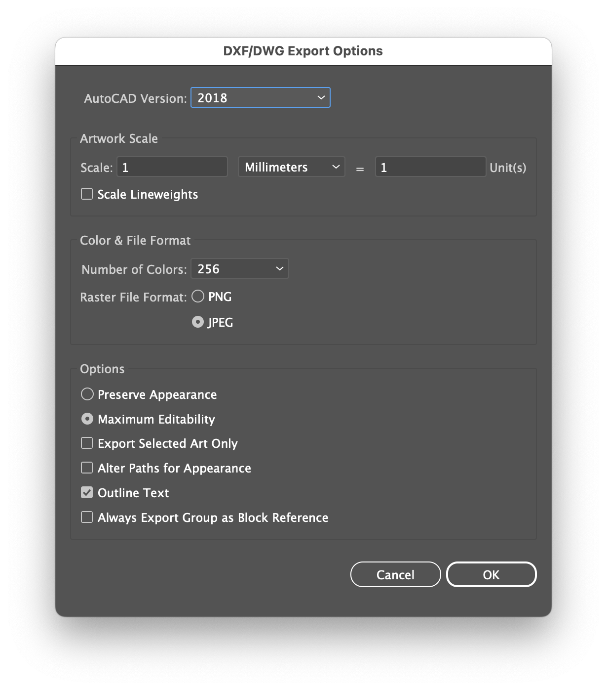

# Lunchbox Luggable

Raspberry Pi Portable


## Overview

A simple Cyberdeck built around the Raspberry Pi and the Pelican 1150 case. Loosely based on Jay Doscher's [Metal Kit](https://doscher.com/work/metal-kit).

## Parts

| **Part**                         | **Link**                                                     | **Quantity** |
| -------------------------------- | ------------------------------------------------------------ | ------------ |
| M3 Washer                        | https://www.amazon.co.uk/3mm-Flat-Washer-Form-Stainless/dp/B08TDPSBBY | 4            |
| Raspberry Pi Standoff Set - 11mm | https://thepihut.com/products/raspberry-pi-standoff-set-11mm | 1            |
| Pelican/Peli 1150 Protector Case | https://peliproducts.co.uk/products/1150-protector-case      | 1            |
| Pelican/Peli 1150 Panel Frame    | https://peliproducts.co.uk/products/1150-panel-frame         | 1            |
| PiJuice 12000mAh Battery         | https://uk.pi-supply.com/products/pijuice-12000mah-battery   | 1            |
| PiJuice HAT                      | https://uk.pi-supply.com/products/pijuice-standard           | 1            |

## Notes

- Changing the screen brightness – https://forums.raspberrypi.com/viewtopic.php?t=214086
- Install Pantheon on Ubuntu - https://askubuntu.com/questions/1432304/how-to-install-pantheon-files-elementary-os-file-manager-in-ubuntu-os-with-op
- Ergogen for keyboard design – https://ergogen.cache.works

  - Generating keyboard PCBs:
    ```bash
    asdf exec npm install
    asdf exec node src/cli.js input.yaml -o output
    ```


## Manufacture

Settings for the Makespace Jaws laser cutter:

- Speed – 10
- Power – 80
- Corner Power – 70

Export as DXF using Adobe Illustrator for AutoCAD 2018:


