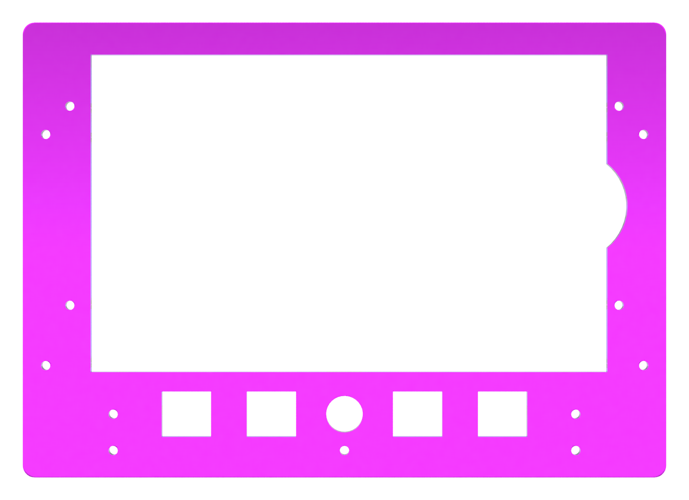
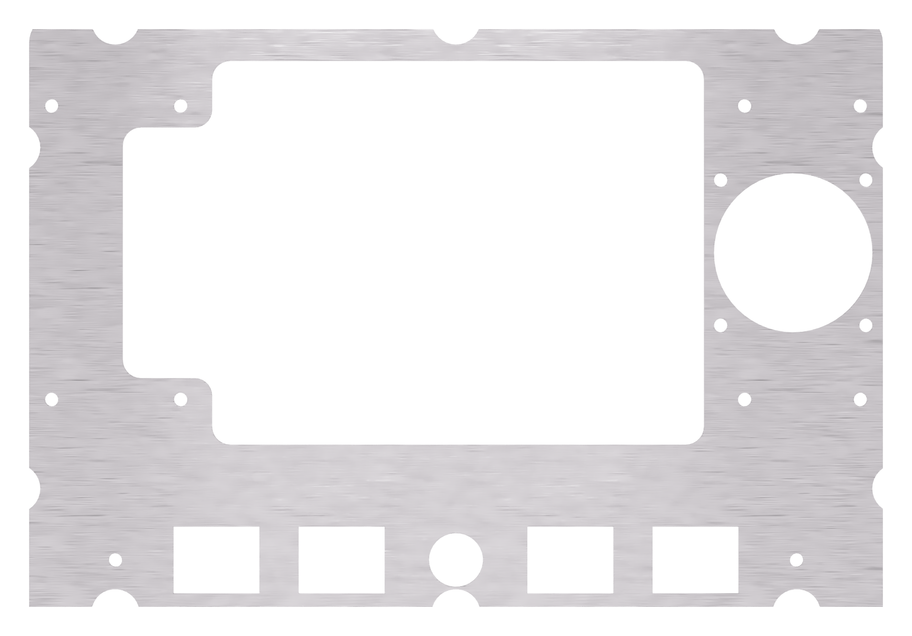
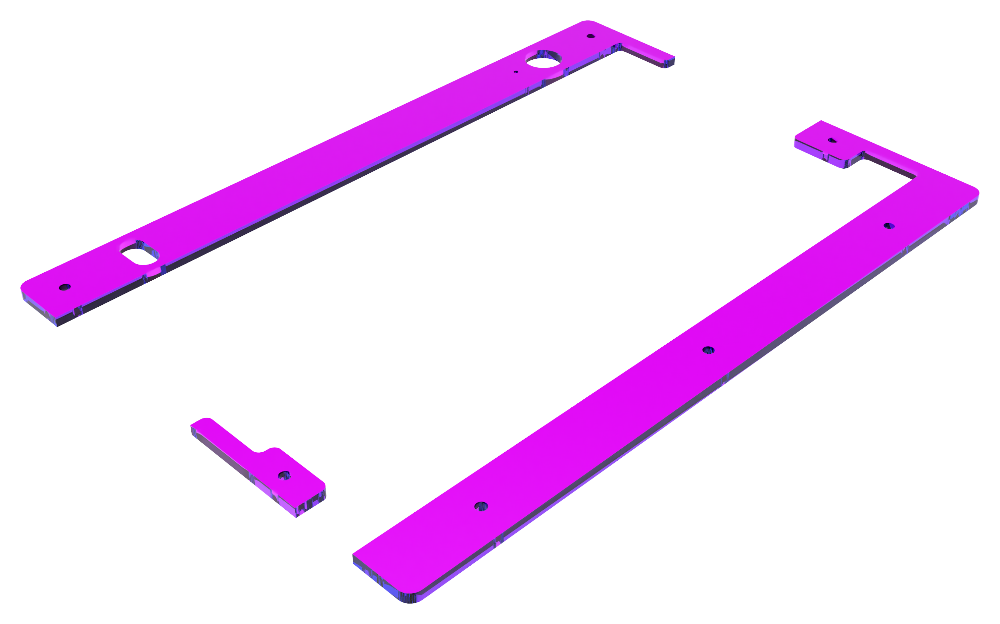

# Little Luggable

Raspberry Pi Portable

## Overview

The Little Luggable is my take on a cyberdeck. It's built around the [Raspberry Pi 4 Model B](https://www.raspberrypi.com/products/raspberry-pi-4-model-b/) and the [Pelican 1150 Protector Case](https://www.peli.com/eu/en/product/cases/protector/1150) and is loosely based on Jay Doscher's [Metal Kit](https://doscher.com/work/metal-kit). It includes a fully-custom mechanical keyboard designed to perfectly fit the lid of the 1150.

Check out the [project page](https://jbmorley.co.uk/projects/little-luggable) on my website for more.

## Parts

Where possible, the Little Luggable uses off-the-shelf parts. I've separated these out and tried to provide links to places you can purchase standard parts. The links are currently pretty UK / US centric and I'd love pull requests for options for other markets.

### Computer

#### Off-the-shelf

| **Part**                                                     | **Quantity** |
| ------------------------------------------------------------ | ------------ |
| [Raspberry Pi 4 Model B](https://www.raspberrypi.com/products/raspberry-pi-4-model-b/) | 1            |
| [Raspberry Pi Touch Display](https://www.raspberrypi.com/products/raspberry-pi-touch-display/) | 1            |
| [PiJuice HAT](https://uk.pi-supply.com/products/pijuice-standard) | 1            |
| [PiJuice 12000mAh Battery](https://uk.pi-supply.com/products/pijuice-12000mah-battery) | 1            |
| [Pelican 1150 Protector Case](https://peliproducts.co.uk/products/1150-protector-case) | 1            |
| [Pelican 1150 Panel Frame](https://peliproducts.co.uk/products/1150-panel-frame) | 1            |
| [M3 Washer](https://www.amazon.co.uk/3mm-Flat-Washer-Form-Stainless/dp/B08TDPSBBY) | 4            |
| [M3 Spacer, 3mm](https://www.amazon.co.uk/dp/B0BHJP3KJP)     | 6            |
| [Raspberry Pi Standoff Set, 11mm](https://thepihut.com/products/raspberry-pi-standoff-set-11mm) | 1            |
| USB-C Keystone                                               | 2            |
| RJ45 Keystone                                                | 1            |
| USB-A Keystone Cable                                         | 1            |

#### Custom

- Fascia, 3mm Acrylic, Laser Cut

  

- Mounting Plate, 1mm Aluminium, Laser Cut
  

### Keyboard

#### Off-the-shelf

| **Part**                                                     | **Quantity** |
| ------------------------------------------------------------ | ------------ |
| [M3 Spacer, 5mm](https://www.amazon.co.uk/dp/B0BHKJG3ST)     | 7            |
| [nice!nano](https://nicekeyboards.com/nice-nano/)            | 1            |
| 6mm tactile push button                                      | 1            |
| [Rama Works GRID Set A Keycaps, Kuro](https://ramaworks.store/collections/grid/products/grid-set-a?variant=16185106235435) | 46           |
| [Rama Works GRID Set B Keycaps, Noct](https://ramaworks.store/collections/grid/products/grid-set-b?variant=31922049286222) | 18           |
| [Kailh MX Hotswap Sockets](https://mechboards.co.uk/products/kailh-hotswap-sockets) | 64           |
| [3.7V 90mAh Lithium Polymer Battery](https://www.ebay.co.uk/itm/195234783901) | 1            |
| [M3 Knurled Insert Nuts, 0.5mm](https://www.amazon.co.uk/dp/B09MCX5HN5) | 5            |
| [1N4148 Throughhole Diode](https://mechboards.co.uk/products/throughhole-diodes) | 64           |
| [12mm Latching Push Button Switch](https://www.amazon.co.uk/dp/B08L484J7W) | 1            |
| M3 Low-Profile Screws, ?mm                                   | 7            |
| M3 Nut                                                       | 2            |
| [90 Degree USB-C Adapter](https://www.amazon.co.uk/dp/B078MX7L84) | 1            |
| M2.5 Screws                                                  | 4            |
| Broaching Nuts                                               | 4            |
| M2.5 Spacers                                                 | 4            |
| Female Dupont Connector                                      | 4            |
| 3D Printed Keyboard Mounts (4 pieces)                        | 1            |
| PCB                                                          | 1            |
| Cherry MX Switches                                           | 64           |
| 90 Degree Headers, 2 wide                                    | 2            |
| Switch Mounting Plate (Laser Cut)                            | 1            |
| Fascia, Laser Cut (3 pieces)                                 | 1            |
| Switch collar, Laser Cut                                     | 1            |

#### Custom

- Fascia, 3mm Acrylic, Laser Cut
  
- Mounting Plate, 1.5mm Aluminium, Laser Cut
- PCB

## Future

- [ ] Aluminium mounting plate
  - [ ] Check aluminium kerfing (measure the computer mounting plate)
  - [ ] Counter-sink the mounting holes
  - [ ] Check the required hole size for M2.5 screws
- [ ] Improve battery and power switch header positions
- [ ] Different facia colours
- [ ] Try 3d printing the switch collar
- [ ] Check mounting plate thickness

## Useful References

- [Changing screen brightness](https://forums.raspberrypi.com/viewtopic.php?t=214086)
- [Install Pantheon on Ubuntu](https://askubuntu.com/questions/1432304/how-to-install-pantheon-files-elementary-os-file-manager-in-ubuntu-os-with-op)
