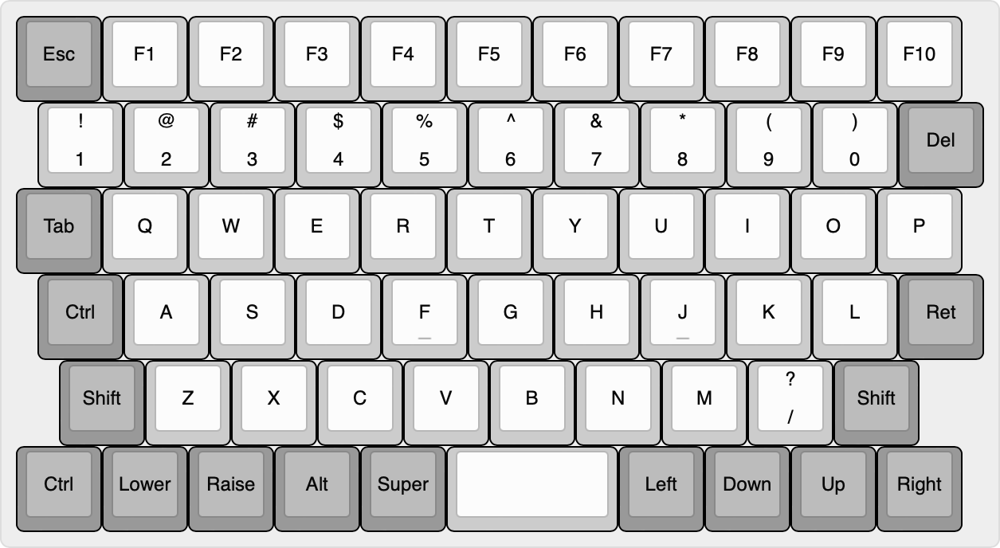

# Little Luggable

Raspberry Pi Portable

## Overview

A simple Cyberdeck built around the Raspberry Pi and the Pelican 1150 case. Loosely based on Jay Doscher's [Metal Kit](https://doscher.com/work/metal-kit).

## Parts

### Computer

| **Part**                         | **Link**                                                     | **Quantity** |
| -------------------------------- | ------------------------------------------------------------ | ------------ |
| M3 Washer                        | https://www.amazon.co.uk/3mm-Flat-Washer-Form-Stainless/dp/B08TDPSBBY | 4            |
| Raspberry Pi Standoff Set - 11mm | https://thepihut.com/products/raspberry-pi-standoff-set-11mm | 1            |
| Pelican/Peli 1150 Protector Case | https://peliproducts.co.uk/products/1150-protector-case      | 1            |
| Pelican/Peli 1150 Panel Frame    | https://peliproducts.co.uk/products/1150-panel-frame         | 1            |
| PiJuice 12000mAh Battery         | https://uk.pi-supply.com/products/pijuice-12000mah-battery   | 1            |
| PiJuice HAT                      | https://uk.pi-supply.com/products/pijuice-standard           | 1            |

### Keyboard

| **Part**      | **Link**                               | **Quantity** |
| ------------- | -------------------------------------- | ------------ |
| 5mm M3 Spacer | https://www.amazon.co.uk/dp/B0BHKJG3ST | 6            |
| nice!nano     | https://doscher.com/work/quick-kit     | 1            |
|               |                                        |              |

## Notes

- Changing the screen brightness – https://forums.raspberrypi.com/viewtopic.php?t=214086
- Install Pantheon on Ubuntu - https://askubuntu.com/questions/1432304/how-to-install-pantheon-files-elementary-os-file-manager-in-ubuntu-os-with-op

## Keyboard Design

Reference:

- [YouTube – Making a Keyboard Macropad PCB (Kicad 6.0)](https://www.youtube.com/watch?v=7O8xGd7Pd88)
- [YouTube – Ben Vallack, Single Button Nice!Nano Keyboard](https://www.youtube.com/watch?v=vr8LkjsRqZs)
- [Broaching Standoff](https://www.youtube.com/watch?v=TuJRveLrtYI)
- [Broaching nuts and standoffs](https://www.inserco.eu/en/broaching-inserts-ipcbricbfhiscbr/)
- [Solderable threaded inserts?](https://www.designdevelopmenttoday.com/new-products/fastening-assembly/fastening-assembly/product/21092287/keystone-electronics-corp-zero-height-threaded-inserts-for-pc-boards)

Renaining:

- [ ] Power switch
- [ ] Check stabilizer orientation and clearance
- [ ] Reset button
  - [ ] Add to PCB
  - [ ] Order switch
  - [ ] Fascia hole

- [ ] Screw mounts to secure the key switch mounting plate to the PCB (perhaps using broaching or surface mount standoffs?)
- [ ] Add Pro Micro footprint to PCB
- [ ] JST connector for the battery
- [ ] Extend the fascia to wrap around the keys where possible and add additional mounting bolts for these
- [ ] Center the fascia bolts vertically in the fascia plate

## Manufacture

Settings for the Makespace Jaws laser cutter:

- Speed – 10
- Power – 80
- Corner Power – 70

Export as DXF using Adobe Illustrator for AutoCAD 2018:

