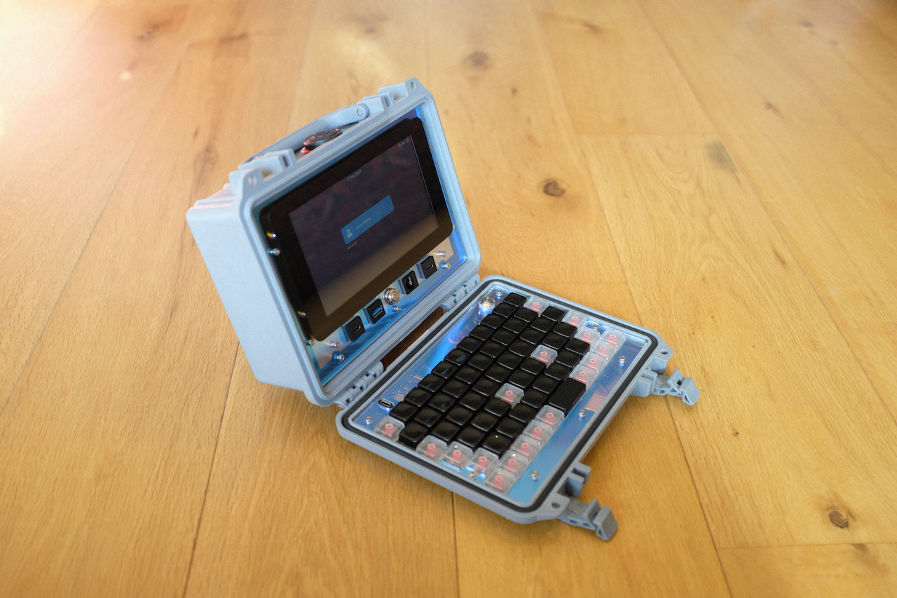

# Little Luggable

Raspberry Pi Portable

## Overview

The Little Luggable is my take on a cyberdeck. It's built around the [Raspberry Pi 4 Model B](https://www.raspberrypi.com/products/raspberry-pi-4-model-b/) and the [Pelican 1150 Protector Case](https://www.peli.com/eu/en/product/cases/protector/1150) and is loosely based on Jay Doscher's [Metal Kit](https://doscher.com/work/metal-kit). It includes a fully-custom mechanical keyboard designed to perfectly fit the lid of the 1150.

## Parts

### Computer

| **Part**                                                     | **Quantity** |
| ------------------------------------------------------------ | ------------ |
| [M3 Washer](https://www.amazon.co.uk/3mm-Flat-Washer-Form-Stainless/dp/B08TDPSBBY) | 4            |
| [M3 Spacer (3mm)](https://www.amazon.co.uk/dp/B0BHJP3KJP)    | 6            |
| [Raspberry Pi Standoff Set (11mm)](https://thepihut.com/products/raspberry-pi-standoff-set-11mm) | 1            |
| [Pelican 1150 Protector Case](https://peliproducts.co.uk/products/1150-protector-case) | 1            |
| [Pelican 1150 Panel Frame](https://peliproducts.co.uk/products/1150-panel-frame) | 1            |
| [PiJuice HAT](https://uk.pi-supply.com/products/pijuice-standard) | 1            |
| [PiJuice 12000mAh Battery](https://uk.pi-supply.com/products/pijuice-12000mah-battery) | 1            |

### Keyboard

| **Part**                                                     | **Quantity** |
| ------------------------------------------------------------ | ------------ |
| [M3 Spacer (5mm)](https://www.amazon.co.uk/dp/B0BHKJG3ST)    | 6            |
| [nice!nano](https://nicekeyboards.com/nice-nano/)            | 1            |
| 6mm tactile push button                                      | 1            |
| [Rama Works GRID Set A Keycaps, Kuro](https://ramaworks.store/collections/grid/products/grid-set-a?variant=16185106235435) | 46           |
| [Rama Works GRID Set B Keycaps, Noct](https://ramaworks.store/collections/grid/products/grid-set-b?variant=31922049286222) | 18           |
| [Kailh MX Hotswap Sockets](https://mechboards.co.uk/products/kailh-hotswap-sockets) | 64           |

## Future

- [ ] Aluminium mounting plate
  - [ ] Check aluminium kerfing
  - [ ] Counter-sink the mounting holes
  - [ ] Check the required hole size for M2.5 screws
- [ ] Improve battery and power switch header positions
- [ ] Different facia colours

## Useful References

- [Changing screen brightness](https://forums.raspberrypi.com/viewtopic.php?t=214086)
- [Install Pantheon on Ubuntu](https://askubuntu.com/questions/1432304/how-to-install-pantheon-files-elementary-os-file-manager-in-ubuntu-os-with-op)
