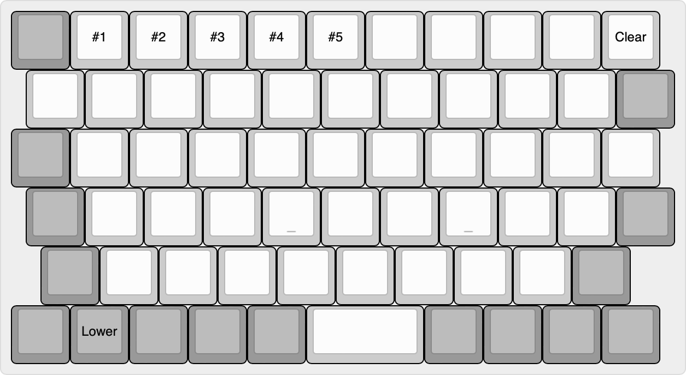

# Keyboard

## Design

The Little Luggable features a custom 64-key keyboard that I created with the very specific goal of deviating as little as possible from a standard keyboard layout.

### Base Layer

### Lower Layer (Bluetooth Controls)

## Useful References

- [YouTube – Making a Keyboard Macropad PCB (Kicad 6.0), Noah Kiser](https://www.youtube.com/watch?v=7O8xGd7Pd88)
- [YouTube – Single Button Nice!Nano Keyboard, Ben Vallack](https://www.youtube.com/watch?v=vr8LkjsRqZs)
- [YouTube – Make your own analog keyboard PCB (in Kicad) - Part 1 (Schematic), riskable](https://www.youtube.com/watch?v=TfKz_FbZWLQ)
- [Broaching Standoff](https://www.youtube.com/watch?v=TuJRveLrtYI)
- [Broaching nuts and standoffs](https://www.inserco.eu/en/broaching-inserts-ipcbricbfhiscbr/)
- [Solderable threaded inserts?](https://www.designdevelopmenttoday.com/new-products/fastening-assembly/fastening-assembly/product/21092287/keystone-electronics-corp-zero-height-threaded-inserts-for-pc-boards)
- [Keyswitch Kicad Library](https://github.com/perigoso/keyswitch-kicad-library)